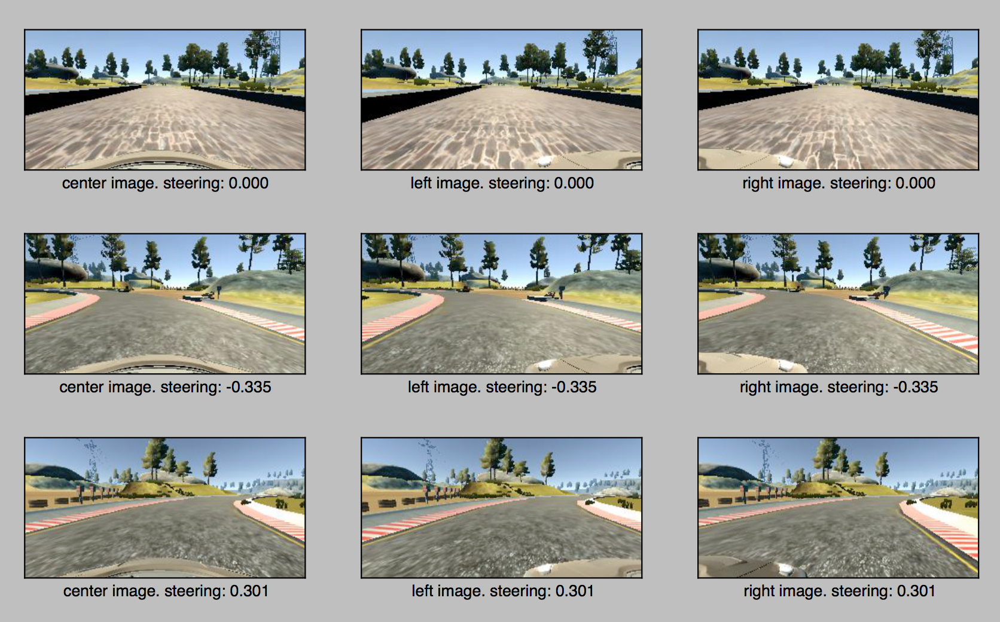
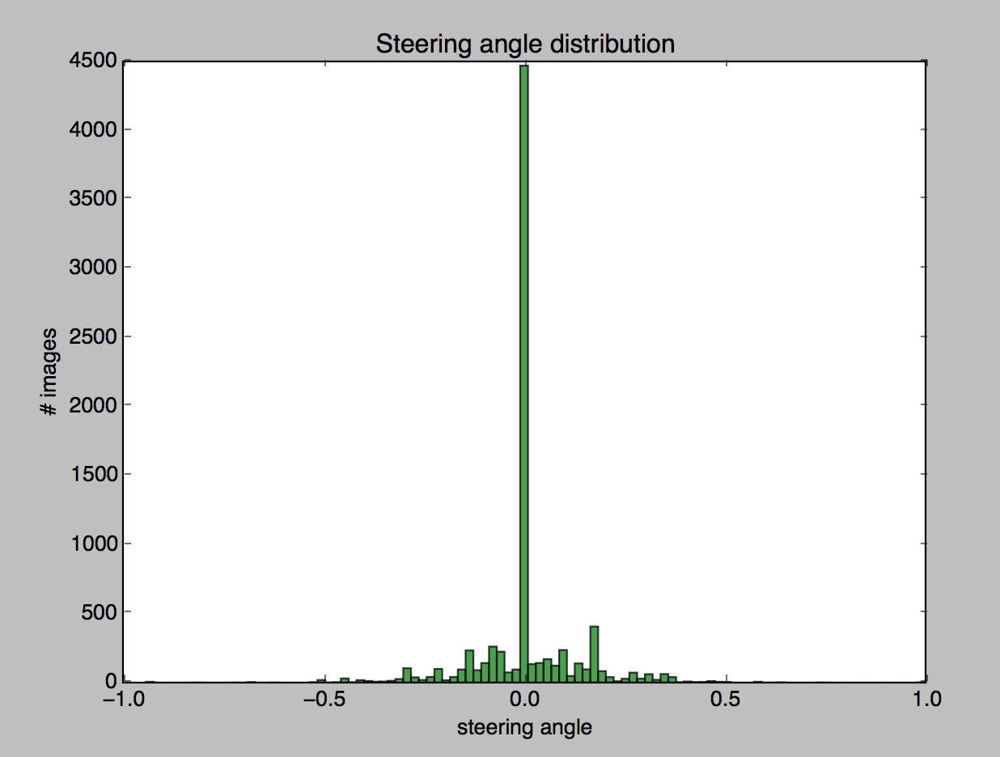
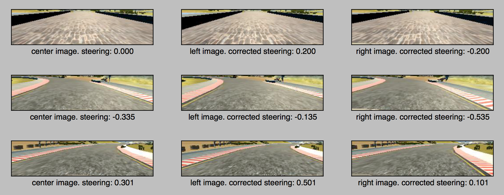
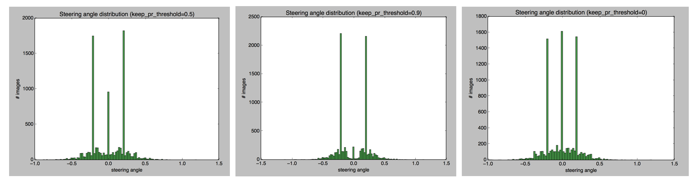
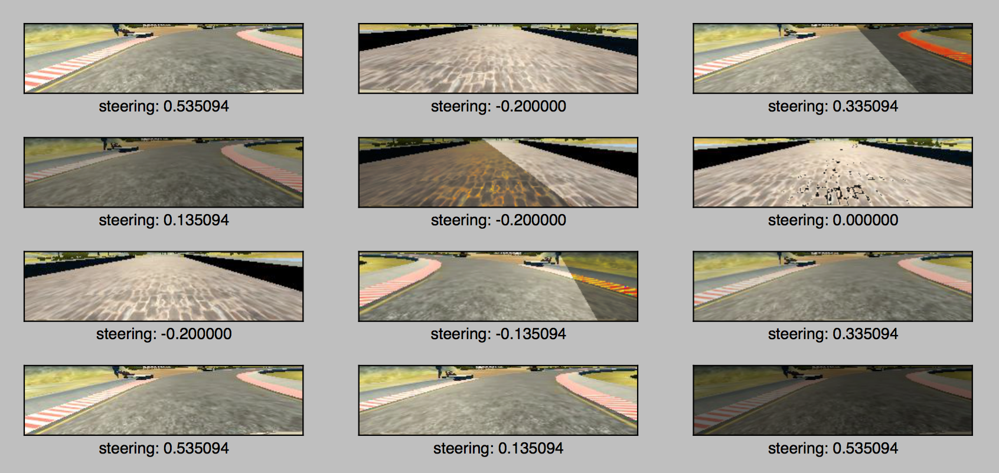

# Behavioral-Cloning

## Problem Definition
This project is an attempt at using Deep CNNs to teach a car how to drive itself. In particular, the model we are training will predict steering angle. I am using training data provided by Udacity. The training data is collected by driving car in a simulator and collecting images captured by cameras mounted at the center, left and right side of the car, along with the steering adjustment.

## Data understanding and visualization
There are about 8000 frames in the dataset. For each entry, we have image captured by center, left and right camera. Following are 3 such examples. First row is when car is going straight (steering = 0), second row is for left turn, and third row is for right turn.

Here is the distribution of steering angles in data. There are a lot of images with steering angle label 0. Because of this bias towards steering angle 0, model built based on just center images was learning to go straight for the most part, even in turns.

## Preprocessing
Looking at the sample images, the top part of the image which has sky, trees etc... adds no relevant information to learn steering angle. Similarly, the bottom part of image has car hood.
* I am cropping out both the top portion and bottom portion of the image.
* Left and right cameras are looking at the road at an angle. So, when using left and right images, I am applying an offset of 0.2. Adding 0.2 offset to left image simulates the car on the left side of the road and the offset adds the steering control to adjust direction to the right to adjust and come back to the center of the road. Similarly, I subtract 0.2 from right camera steering. This technique of using left and right images as well for training is described NVIDIA paper.

Here are the same sample images after applying the crop and camera angle correction.

## Model Architecture
I implemented both NVIDIA model and comma.ai model. After data augmentation, NVIDIA model performed better. NVIDIA model was able to drive a real world self driving car without human intervention.

The model consists of an input in the form of a 66x200 sized image which is fed into a CNN of 24 filters followed by a CNN of 36 filters followed by a CNN of 48 filters followed by 2 CNNs of 64 filters. I use strided convolutions in the first three convolutional layers with a 2×2 stride and a 5×5 kernel and a non-strided convolution with a 3×3 kernel size in the last two convolutional layers. I used ELU for activation functions, because ELUs have smoother derivatives at zero, and hence are expected to be slightly better and converge faster for predicted continuous values. I am using 'valid' padding to prevent introduction of unwanted edges in our resized data.

After flattening the output of last convolution layer, there are 4 fully connected layers. The output of the last layer doesnt have any activation function, and is the steering angle prediction.

NVIDIA frame work doesn't use dropouts, and so I am not using dropout layers in my model too. I noticed that adding dropouts severely degrades performance on both the tracks. This is because of the low volume of training data available. To avoid overfitting, I am augmenting data with noise heavily. This is described in detail in below.

I am using Adam optimizer, so that we don't have to specify learning rate. Adam optimizer served me well in my previous projects.

Here is the architecture diagram:

## Data Augmentation
8K samples is not enough to train a model as complicated as described in NVIDIA paper. I tried to augment data by building my own training/recovery data using simulator. However I got better results by using just the udacity data and augmenting it. Eventually I trained with around 40K samples post augmentation.

I followed some techniques mentioned in NVIDIA paper and some from CarND forum, which was very helpful.

* I am using left, right and center images captured in the training data. However in the test run, I only use the center images. This increases the training data available by 3x.
* I randomly select between left, right and center image
* When left/right images are picked, I apply steering angle correction of 0.2
* I randomly add shadows to image, and also change brigtness of the entire image. This deliberate introduction of noise is to avoid overfitting the original data.
* I noticed that the training data udacity provided has car going clockwise, where as the track goes counter clock wise. Also the distribution of left and right turns is not even in the data. So, I randomly also flip the image across vertical access and multiply steering angle with -1.
* NVIDIA pipeline uses image size of 66x200. So, I resize the image to 66 rows, 200 columns.
* I am using all RGB channels, and normalize their values to lie between [-0.5, 0.5]
* I am using a generator to feed training data into keras optimizer. Since there are a lot more frames with steering angle of 0, add a pr_threshold in the generator to generate samples that have a steering_angles greater than 0.1 using probablity threshold of keep_pr_threshold

Here is how keep_pr_threshold affects steering angle distribution in data after the other augmentation techniques described above:

Here are some sample images after following the augmentation I described above:

* I use 5x as many input images (i.e around 40K images) from generator to train the model
* I trained model with 5 epochs and pr_threshold=0.5, 0.9, 0.0. I also added capability to read a pre-trained model from last iteration and train that model, similar to transfer learning. This helped me converge faster as I added more augmentation logic.
* I have another generator for validation data. This generator only uses center image and normalizes the image (crop top and bottom, resize, and normalize RGB values to [-0.5, 0.5]). This simulated the images used in drive mode by the simulator.

## Modifications to drive.py :
I modified the drive.py to limit the car speed to 15MPH. Also, I normalize the image by calling the normalization method used while building training data.

## Results:
Here's a video of how my model performs on track 1 (for which we have training data) and track 2 (challenge track).

Demo video (https://youtu.be/Qnh9jU6xec0)

* The model works well at the turns.
* However when road is straight, the model constantly keeps correcting by weaving left and right
* Although I didn't use any training data from the challenge track, the model seems to perform very well on this track. This is because of the noise I added by introducing shadows and random brightness to training data.

## References

[1] NVIDIA paper -  https://images.nvidia.com/content/tegra/automotive/images/2016/solutions/pdf/end-to-end-dl-using-px.pdf

[2] Training data - https://d17h27t6h515a5.cloudfront.net/topher/2016/December/584f6edd_data/data.zip

[3] Comma.ai steering model - https://github.com/commaai/research/blob/master/train_steering_model.py

[4] https://carnd-forums.udacity.com/questions/26214464/behavioral-cloning-cheatsheet

[5] https://medium.com/@kikiorgg/sdc-proj3-for-impatient-people-aad78bb0dc99#.7mhi68wme

[6] https://github.com/rush00121/behavioral_cloning

[7] https://github.com/dolaameng/Udacity-SDC_Behavior-Cloning

[8] https://github.com/diyjac/AgileTrainer
